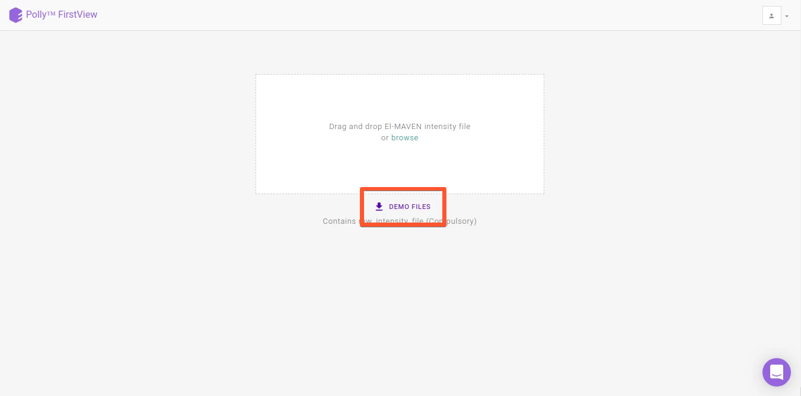
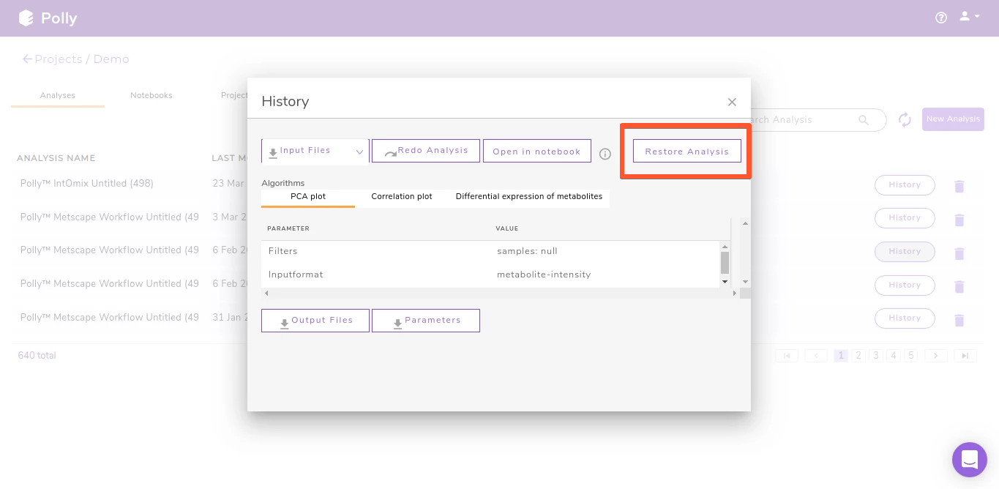
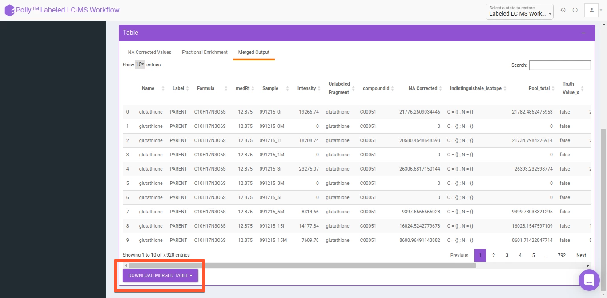

#Introduction

The applications on Polly are built to process and visualize experimental data ranging from mass-spec based omics to sequencing-based omics, from dual-mode data visualization to the analysis of CRISPR screening. Though despite the variety and specificity of the apps present on Polly, there are a couple of features common across all apps. These features are built to help you get started with minimal effort, analyze and share results and processed data with your collaborators with ease.

#This is how I write code

    Code line 1
    Code line 2
    Code line extremely long. These features are built to help you get started with minimal effort, analyze and share results and processed data with your collaborators with ease.

##Demo Data

To help you get started even if you do not have your own data, every app on Polly has demo data uploaded as shown in Figure 1, Figure 2 and Figure 3. Moreover the demo data also serves as a reference point for the input files and their format required for each app.

 
**Figure 1.** Demo Data for FirstView

 
**Figure 2.** Demo data for MetScape

**Figure 3.** Demo data for Labeled LC-MS app

##Restore Analysis

All applications built on Angular framework (El-MAVEN Phi Relative LC-MS, FirstView, MetScape, QuantFit, CRISPR Screening and Polly IntOmix) and Shiny framework (Dual Mode Data Visualization, Labeled LC-MS Workflow, Labeled LC-MS/MS Workflow, Untargeted Pipeline, High Throughput Drug Screening, RNA Seq Workflow, Proteomics Workflow and Lipidomics Visualization Dashboard) contain the restore functionality that allows any analysis to be restored to the last step. The Shiny applications also provide the ability to save at that exact moment of your choice using the *Save the State* option. Analyses can be restored by navigating to the *Analysis* section of a project. Click on *History* for the specific analysis to restore. For Angular applications, clicking on *Restore Analysis* will take you back to the application with the same data used before as shown in Figure 4. For Shiny applications, you have an additional step to choose which step to restore. Multiple states, if saved are depicted as a branch structure which makes it extremely easy to visually identify the state of interest as shown in Figure 5 and Figure 6.  Restore helps laboratories and organizations with standardization across labs and improves reproducibility.

 
**Figure 4.** Restore for Angular applications

 
**Figure 5.** Restore for Shiny applications

 
**Figure 6.** Branch structure in case of multiple states saved during a single analysis for Shiny applications

##Download Plots & Output

All applications on Polly allow you to download processed data and plots when displayed so that if needed you can verify from a third party about exactly how the data is being processed at a specific step. The tabular data can be downloaded as .csv files whereas the plots can be downloaded as .png, .jpeg or .svg files as shown in Figure 7, FIgure 8 and Figure 9.

**Figure 7.** Download Pathway Dashboard as an image or the processed data as a .csv file

 
**Figure 8.** Download PCA Plot as an image

 
**Figure 9.** Download the processed data as a .csv file

