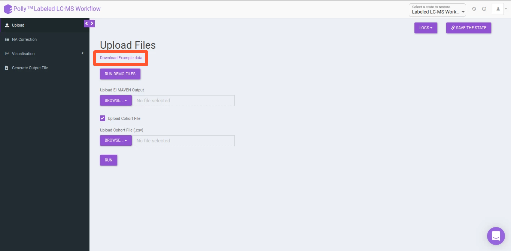
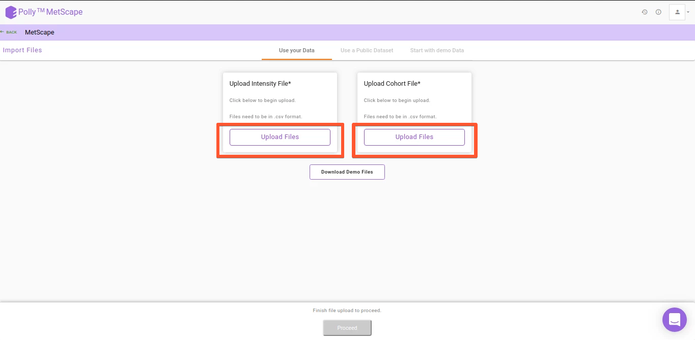
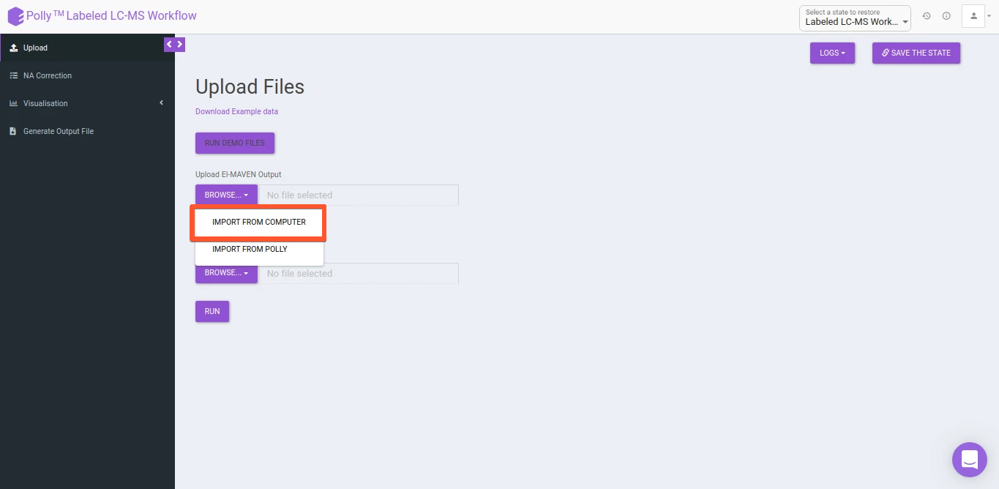
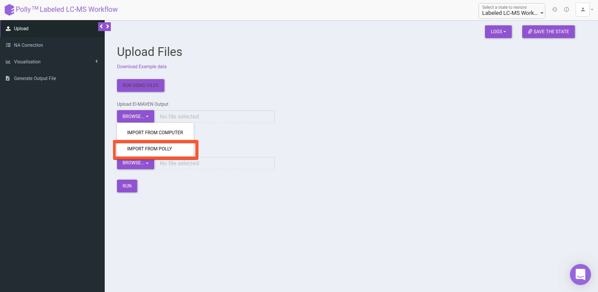
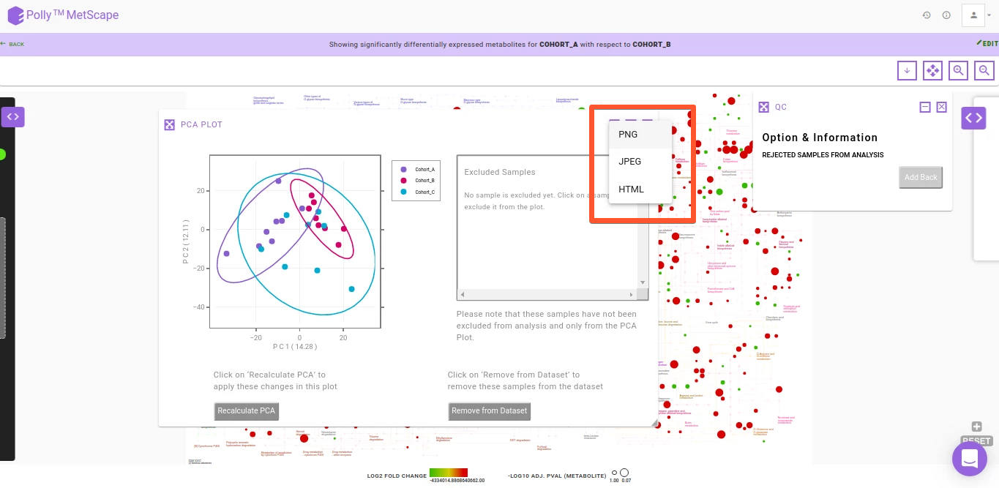

#Overview

The applications on Polly are built to process and visualize experimental data ranging from mass-spec based omics to sequencing-based omics, from dual-mode data visualization to the analysis of CRISPR screening. Though despite the variety and specificity of the apps present on Polly, there are a couple of features common across all apps. These features are built to help you get started with minimal effort, analyze and share results and processed data with your collaborators with ease.

##Demo Data

To help you get started even if you do not have your own data, every app on Polly has demo data uploaded as shown in Figure 1, Figure 2 and Figure 3. Moreover the demo data also serves as a reference point for the input files and their format required for each app.

 
**Figure 1.** Demo Data for FirstView

 
**Figure 2.** Demo data for MetScape

**Figure 3.** Demo data for Labeled LC-MS app

##Upload Data

All applications built on Angular framework ([El-MAVEN Phi Relative LC-MS](../El-MAVEN Phi Relative LC-MS), [FirstView](../FirstView), [MetScape](../MetScape), [QuantFit](../QuantFit), [CRISPR Screening](../CRISPR Screening) and [IntOmix](../IntOmix)) and Shiny framework ([Dual Mode Data Visualization](../Dual Mode Data Visualization), [Labeled LC-MS Workflow](../Labeled LC-MS  Workflow), [Labeled LC-MS/MS Workflow](../Labeled LC-MS/MS Workflow), [Untargeted Pipeline](../Untargeted Pipeline), [High Throughput Drug Screening](../High Throughput Drug Screening), [RNA Seq Workflow](../RNA Seq Workflow), [Proteomics Workflow](../Proteomics Workflow) and [Lipidomics Visualization Dashboard](../Lipidomics Visualization Dashboard)) provide you the option to upload from local storage.

**Figure 4.** Upload data from local storage for MetScape

**Figure 5.** Upload data from local storage for Labeled LC-MS app

The Shiny applications also provide the ability to uplaod input files from Polly Project Files by using the option *Import from Polly* as shown in Figure 6. This simplifies data processing as well as makes Polly the platform where biological data can be stored and processed conveniently. 

**Figure 6.** Upload data from project files for Labeled LC-MS app

##Restore Analysis

All Angular <!-- ([El-MAVEN Phi Relative LC-MS](../El-MAVEN Phi Relative LC-MS), [FirstView](../FirstView), [MetScape](../MetScape), [QuantFit](../QuantFit), [CRISPR Screening](../CRISPR Screening) and [IntOmix](../IntOmix)) --> and Shiny applications <!-- ([Dual Mode Data Visualization](../Dual Mode Data Visualization), [Labeled LC-MS Workflow](../Labeled LC-MS  Workflow), [Labeled LC-MS/MS Workflow](../Labeled LC-MS/MS Workflow), [Untargeted Pipeline](../Untargeted Pipeline), [High Throughput Drug Screening](../High Throughput Drug Screening), [RNA Seq Workflow](../RNA Seq Workflow), [Proteomics Workflow](../Proteomics Workflow) and [Lipidomics Visualization Dashboard](../Lipidomics Visualization Dashboard)) --> contain the restore functionality that allows any analysis to be restored to the last step. The Shiny applications also provide the ability to save at that exact moment of your choice using the *Save the State* option. Analyses can be restored by navigating to the *Analysis* section of a project. Click on *History* for the specific analysis to restore. For Angular applications, clicking on *Restore Analysis* will take you back to the application with the same data used before as shown in Figure 5. For Shiny applications, you have an additional step to choose which step to restore. Multiple states, if saved are depicted as a branch structure which makes it extremely easy to visually identify the state of interest as shown in Figure 8 and Figure 9.  Restore helps laboratories and organizations with standardization across labs and improves reproducibility.

 
**Figure 7.** Restore for Angular applications

 
**Figure 8.** Restore for Shiny applications

 
**Figure 9.** Branch structure in case of multiple states saved during a single analysis for Shiny applications

##Download Plots & Output

All applications on Polly allow you to download processed data and plots when displayed so that if needed you can verify from a third party about exactly how the data is being processed at a specific step. The tabular data can be downloaded as .csv files whereas the plots can be downloaded as .png, .jpeg or .svg files as shown in Figure 10, FIgure 11 and Figure 12.

**Figure 10.** Download Pathway Dashboard as an image or the processed data as a .csv file

 
**Figure 11.** Download PCA Plot as an image

 
**Figure 12.** Download the processed data as a .csv file

As with upload, data can be downloaded to local storage for Angular and Shiny apps as well as Polly Project Files for Shiny apps.

##Reports

Reports serve as the culmination of each analysis where all plots and insights generated are added in a way that is easy to understand and draw conclusions from when shared with collaborators or even used as a point of reference for something done earlier. Presence of reports for each analysis ordered sequentially promotes reproducibility across the laboratory or the organization and reduces the manual labor involved in knowledge transfer. 

To ensure that you do not spend a lot of time in downloading plots and arranging them in a pre-defined order with the insights generated each time for a study, we have built One Click Report (OCR), functionality that allows you to generate reports in a standardized format.

**Customization**

The major advantage with our implementation is customization and ease of use. With our framework, we can implement an OCR for you on the app of your choice within *1 week*. You can customize the structure of the report, any text to be included and the plots themselves. Plots not on the app can be added as well as the existing plots modified according to your requirements. 

Currently, custom OCR is integrated in the following apps:

*   [MetScape](Apps/MetScape.md/#one-click-reportbeta)