#Introduction

##Overview

Understanding the biochemical characteristics of metabolites is crucial for metabolomics studies in order to gain insights into complex biological systems and to understand the systemic effects of diseases and drugs. With the advancement in high-throughput technologies, it is now possible to perform large-scale metabolomics studies. However, key challenges remain in peak detection and manually curating the global profile of metabolites from multiple biological samples, which requires considerable time and expertise. 

Polly-PeakML is a novel machine-learning tool that enables the curation of peak groups into real-signal and noise and provides additional information by correlating features and variation across cohorts, in a matter of minutes. 

##Scope

* Make use of [El-MAVEN](https://resources.elucidata.io/elmaven) for automated peak-picking and displaying curated results.
* Raw data to curated peak-groups in minutes.
* Process high-resolution and low-resolution data of up to 100 samples.

 
**Figure 1.** Polly-PeakML workflow

#Getting Started

##User input

Polly-PeakML is capable of processing the file-format supported by El-MAVEN.

PeakML requires two types of files: 

**Sample Files**

Followings sample file formats are supported -

* .mzXml / .mzxml
* .mzMl /  .mzml
* .emDB / .mzroll
* .mzPeaks

**Cohort Information File**

Following cohort file format is supported -

* .CSV / .csv

##Steps for data processing 

**Load samples and cohort file**

You can load the sample by going to *Load Samples|Workspaces|Peaks* option in the Sample space menu. Then navigate to the folder containing the sample data and select all .mzXML or .mzML files. A loading bar displays the progress at the bottom. When the samples have loaded, you should see a sample panel on the left side.

Likewise, you can load the cohort information by choosing the *upload* option in the sample space menu. 

The uploaded information would be rendered on El-MAVEN as shown in figure 2.

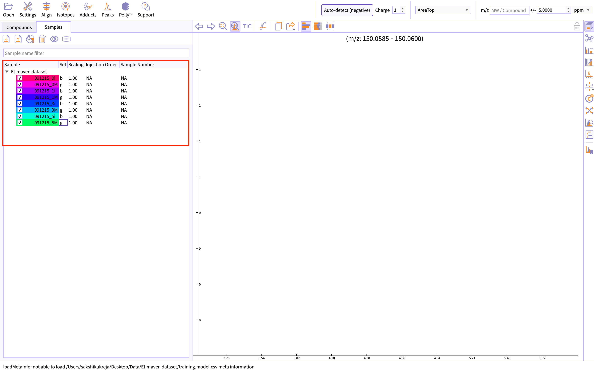 
**Figure 2.** Upload samples and cohort information

**Adjust global parameters**

Change global settings for El-MAVEN by clicking the *settings* icon given on the menu bar of the appliication. 

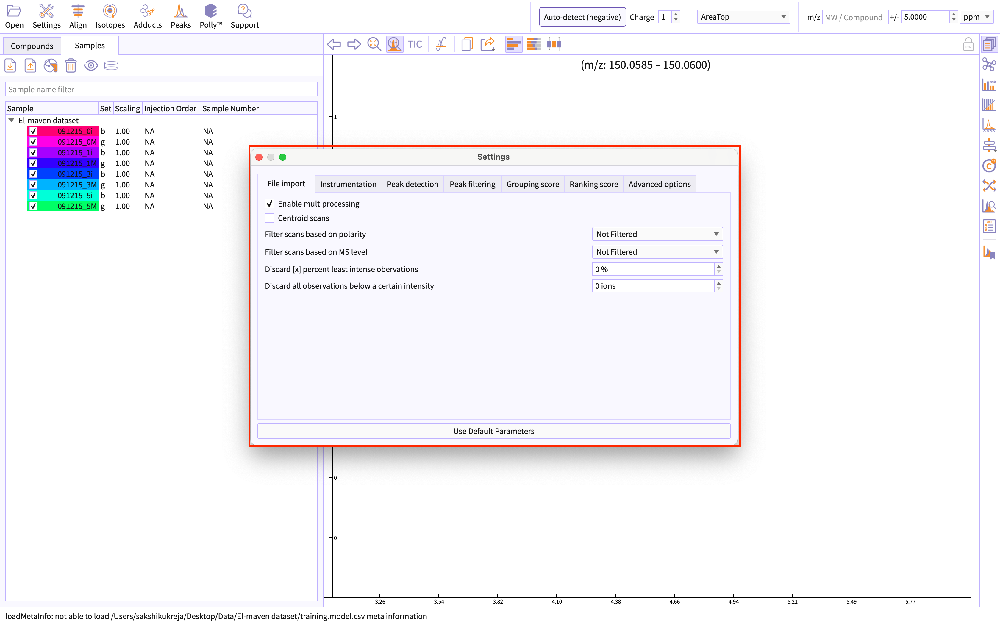 
**Figure 3.** Global Settings Dialog

**Perform Alignment**

Alignment shifts the peak RTs in every sample to correct for this drift and brings the peaks closer to median RT of the group. *Alignment visualization* can be used to judge the extent of deviation from median RT. 

You can perform alignment by going to the option *Alignment* given on the menu bar of application.

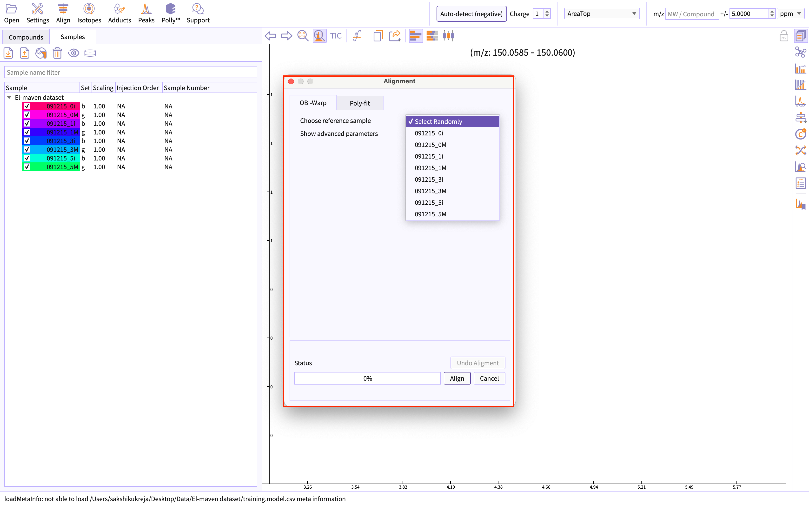 
**Figure 4.** Alignment Dialog

**Peak Detection and Curation**

* Select Peak Detection flow - *Automated feature detection or Compound database search*.

    Polly-PeakML supports curation of peakgroups detected by both the available El-MAVEN's peak detection flow. 

    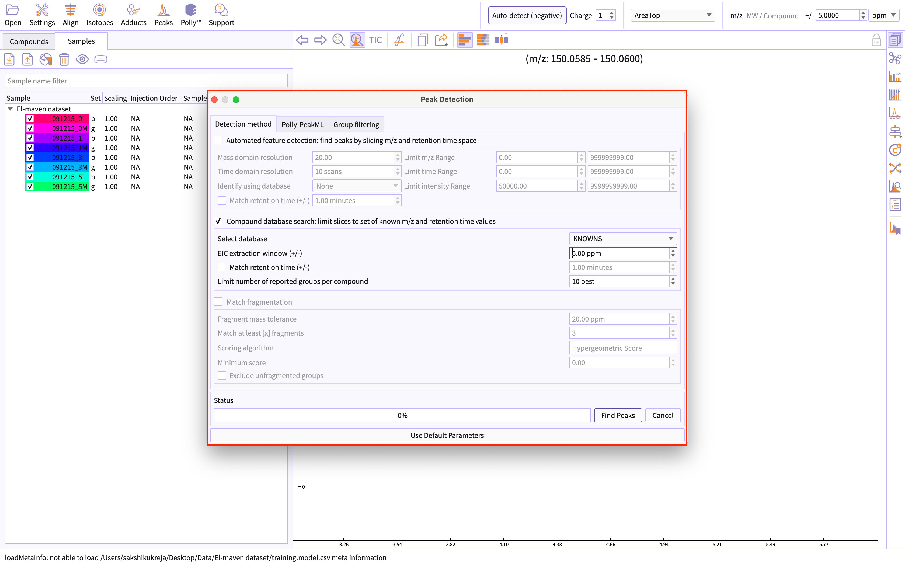 
**Figure 5.** Select peak detection method

    
* Select Polly-PeakML options

    Move to the *Polly-PeakML* tab:  Click on the *‘peak curation’* checkbox. 

    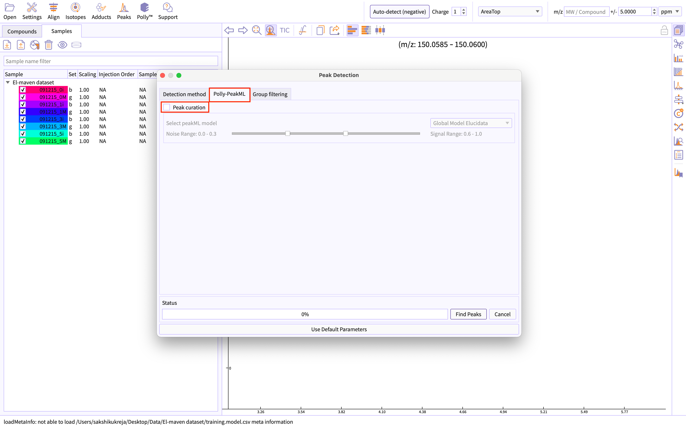 
**Figure 6.** Select peak cuation

    Authenticate yourself for PeakML license: PeakML Models are proprietary to the organization and require you to be authorized for the same to use PeakML.

    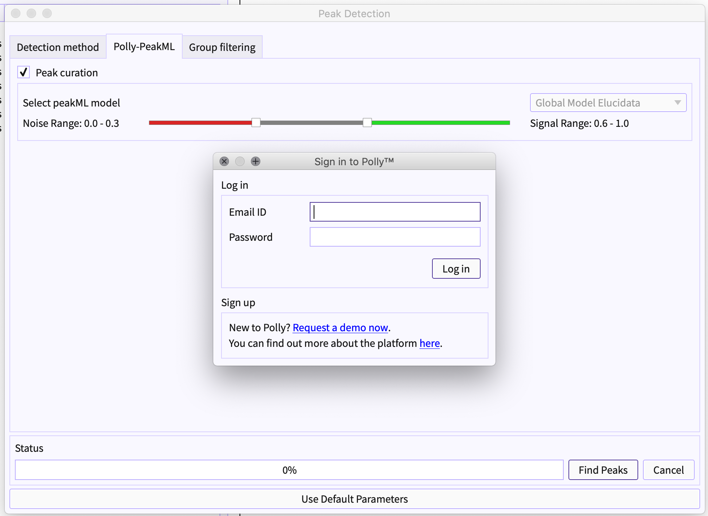 
**Figure 6.** Authenticate using Polly credentials

    Choose Models from the list: Different models can be available to different users. The list of the models depends on the your license for the same. 

    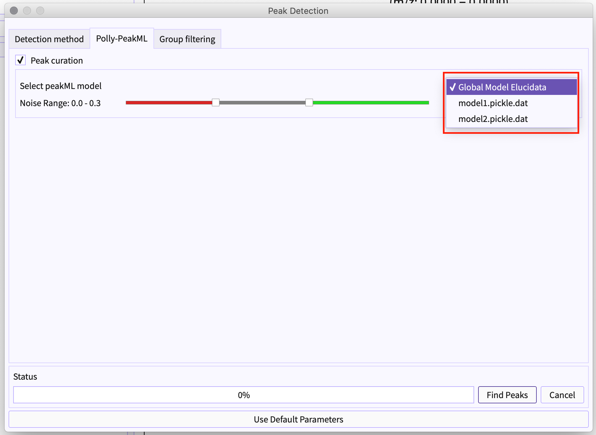 
**Figure 7.** Select PeakML Model

    Slider - Using Slider, you can set the range of the classified label to be bad or signal accordingly. For example, if the range is set to 0.0 to 0.3 (that is marked by red) this determines that the group has a probability of less than 0.3 would be noise. Similarly, the peak-groups with a probability of more than 0.6 (marked by green) would be a signal ( that is a good peak-group).

    The gray region in slider from 0.3 to 0.6 is marked as - ‘Maybe good peak-group’

    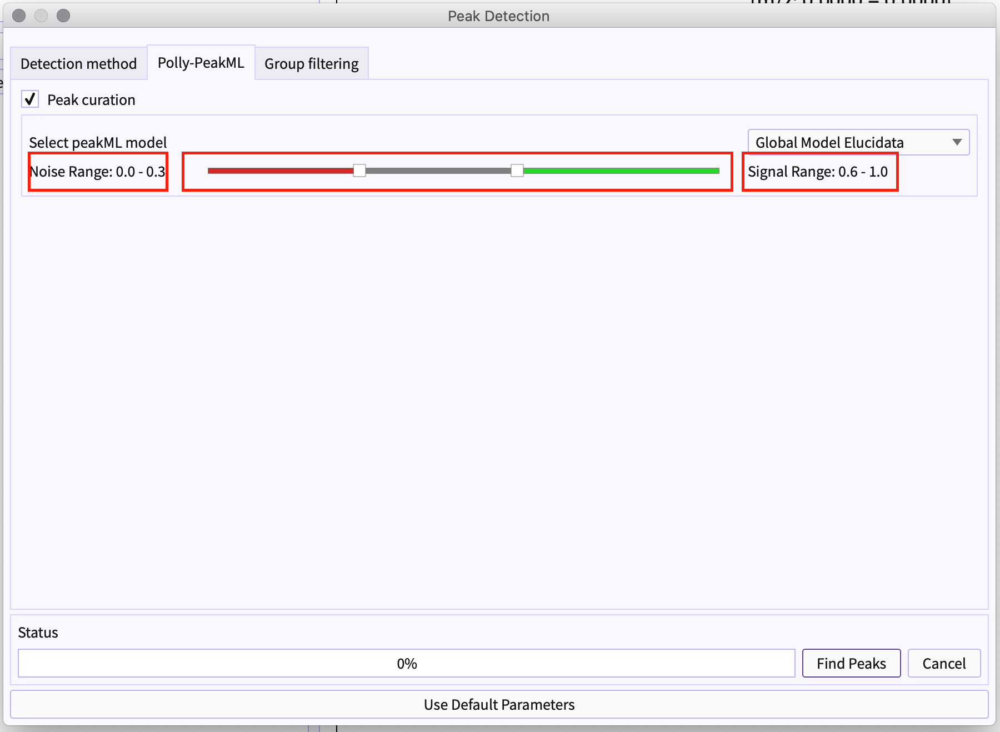 
**Figure 8.** Adjust slider

* Caveats 
    
    * The ML Model is for feature detection. It can distinguish between good peak-groups and noise peak-groups. It's not trained to distinguish between matched and unmatched peak-groups for targeted analysis. 

    * For targeted analysis, it can eliminate noise peak-groups but required manual curation to select the matched peak-group from all the good peaks that are detected for a given m/z and RT.

#Tutorial

**Classified Peak Table**

* Peak-tables have two additional columns than usual, namely, *Labels* and *Classification probability*. 

* Labels - Polly-peakML classifies the peak-groups into six different classes.
    
    * Signal: Good peak-group.
    * Signals with correlation: Good peak-group correlated with other peaks within the same RT window.
    * Signal with cohort-variance: Good peak-group showing some interesting patterns across defined cohorts.
    * Signals with both correlation and cohort-variance: Good peak-group with both the above-mentioned properties.
    * Noise: Bad peak-group.
    * MayBe Good: Peak-group may be a real signal or not.

* Classification Probability - The probability value which defines the certainty of the model to classify the peak group as signal or noise.

 
**Figure 9.** Classified Peak Table

**Labels drop-down in the peak-table menu** 

Using ‘labels’ dropdown, you can filter out the classes that you do not wish to see in the table. 

 
**Figure 10.** Understanding Labels

*  Percentage beside the *Label* name depicts the percentage of the peak-groups that are present in the current peak-table. For example, ‘Noise(13.74%)’ represents that 13.74% of all peak-groups are noise i.e bad peak-groups. 

* You would need to uncheck the label that you want to filter out in the peak-table.

 
**Figure 11.** Filter peak groups using *Labels* dropdown

**Relabel peak-groups**

If in case you have applied stringent slider parameters in the *peak detection dialog*, using *Re-label* option you can change the limit of noise and signal and the peak-table would be re-classified based on their probability score. 

 
**Figure 12.** Relabeling peak groups

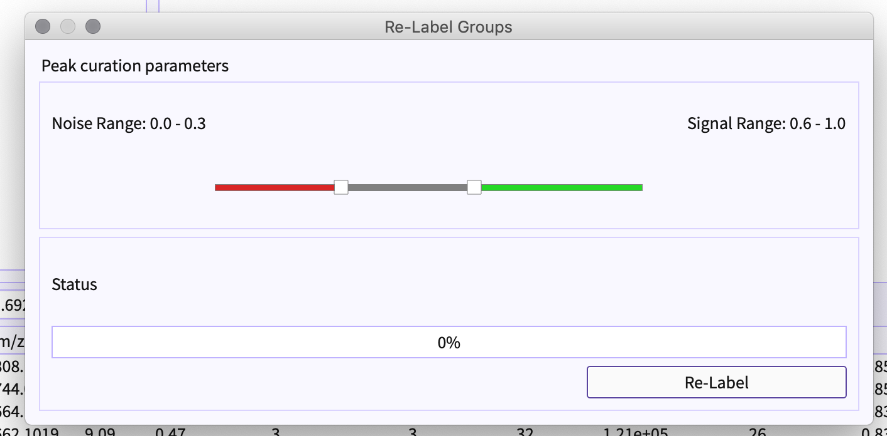 
**Figure 13.** Relabel Dialog

**Correlation Table**

The groups that are labeled with yellow stars determines that the peak-group is a signal and correlated with other groups in tables. This table contains all those correlated groups in descending order of the correlation percentage.

 
**Figure 14.** Correlation Table

**Understanding Classification**

Polly-PeakML uses *shap plot* to explain the attributes that contributes in deciding the label of the peak-group.

On selecting a peakgroup in the table and right clicking it, a context menu appears. The option *Explain Classification* in the menu opens the layout that shows the shap plot for the selected peak-group.

 
**Figure 15.** Explain Classification

Red arrows in the *figure 16* depicts the attributes of the peak-group that contributes to the signal whereas blue arrows represent the attributes that contribute to noise.

If the output value is greater than the base value it determines the peak-group to be signal otherwise a noise.

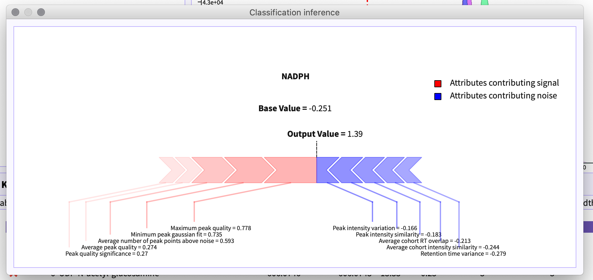 
**Figure 16.** Classification Inference

**Setting Logs**

You can check the settings and parameters that were set while detecting the peak-table by going to the *Settings* option given in peak-table menu bar. 

 
**Figure 17.** Setting Logs Option

Curation Parameters used in PeakML can be found in the setting logs for your reference. 

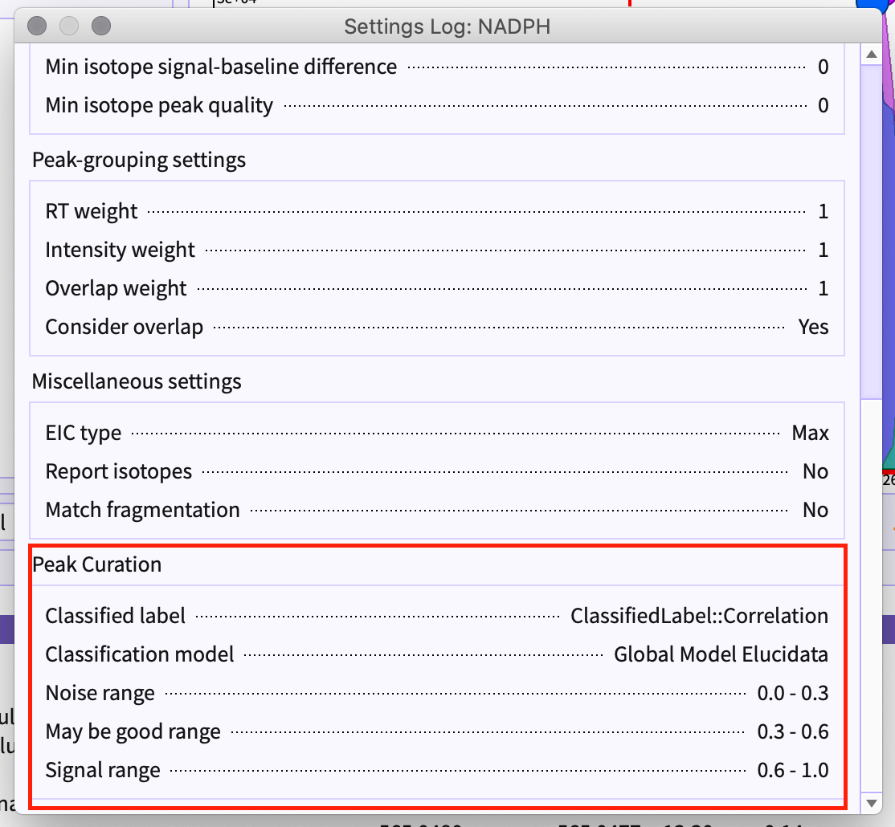 
**Figure 18.** Peak curation settings

##Exporting Results

**As csv and pdf**

You can export the results of the classified peak-table in form of csv and pdf. Following are the options provided to you to export the results - 

* Export selected groups - You can manually select the peak-groups in the peak-table that you want to export as csv or pdf files.

* Export displayed groups - You can filter out the peak-groups in peak-table using labels drop-down. This option exports all the peak-groups that are currently visible in peak-table i.e. filtered out peak-groups would not be exported. 

* Export all signals- This option exports all the signals i.e peak-groups with following labels are exported - 

    * Signals: Good peaks.

    * Signals with correlation: Good peaks correlated with other peaks.

    * Signal with cohort-variance: Good peaks showing some interesting patterns.

    * Signals with both correlation and cohort-variance: Good peaks with both the above-mentioned properties.

 
**Figure 19.** Export peak-groups to CSV
    

**As emDB**    

* Export project as emDB 
    
    El-MAVEN projects can be exported as emDB that saves the entire session of analysis as SQL tables. Opening an emDB in the application would restore the settings and the peak-tables that were detected. 

    You can save the session by going to the option *Save project* provided in the menu bar of the application. 

    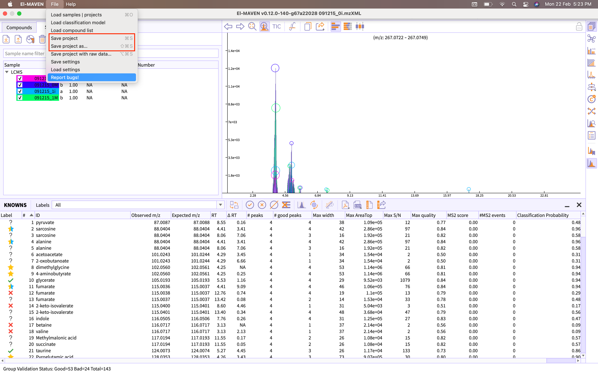 
**Figure 20.** Export session as emDB
  

* Export project as emDB with Raw Data.

    El-MAVEN is capalble of exporting projects with raw data i.e. this type of session files would store EIC information as the part of emDB. 

    You can save the session as raw project by going to the option *Save project as raw data* provided in the menu bar of the application. 

    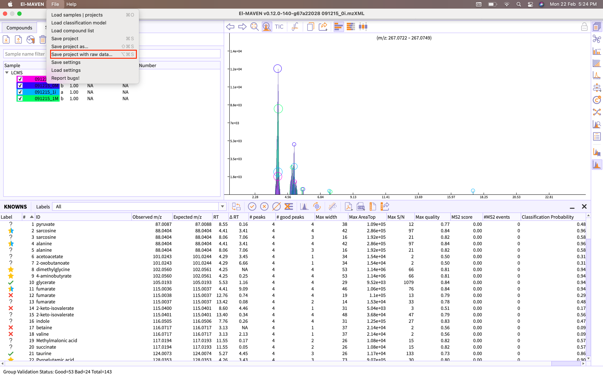 
**Figure 21.** Export session as emDB with raw data
  

    You are provided with following two options of exporting emDB with raw data - 

     
**Figure 22.** Range of EIC(s) to be exported
  
    
    * Sliced EIC - Exports EIC(s) in the range of RT(Retention Time) of the peakgroup that is being exported. 

    * Complete-range EIC - Exports EIC(s) in the range of the minimum to maximum retention time of the uploaded samples.

#Export Results to Polly Workspace

You can upload session files to Polly workspaces for further analysis. 

Following are the steps that must be followed to upload files -

* Pre-requisites 

    * You must be authorized for using Polly. 
    * You must have valid credentials for Polly. 

* Click on *Polly* icon provided on the main window to access Polly El-MAVEN Interface.

    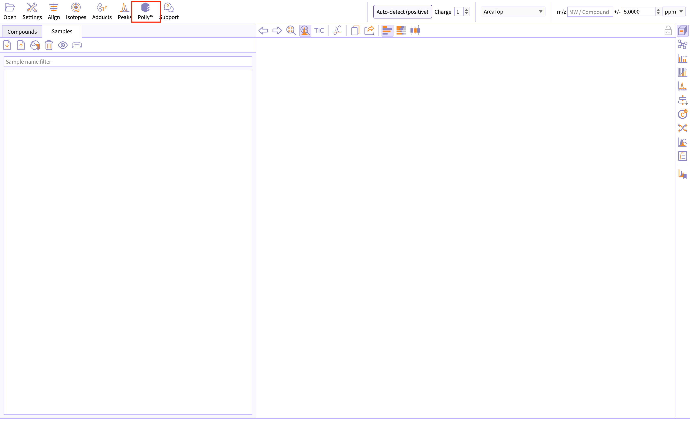 
**Figure 23.** Accessing Polly
  

* Authorize using polly credentials.

    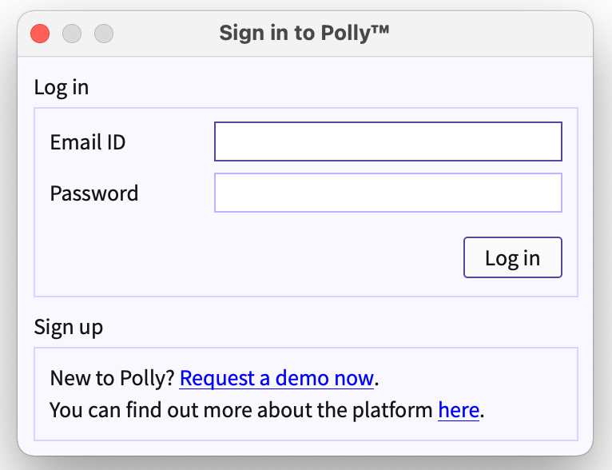 
**Figure 24.** Log in using polly credentials
  

* If you are authenticated, EPI Dialog appears.

    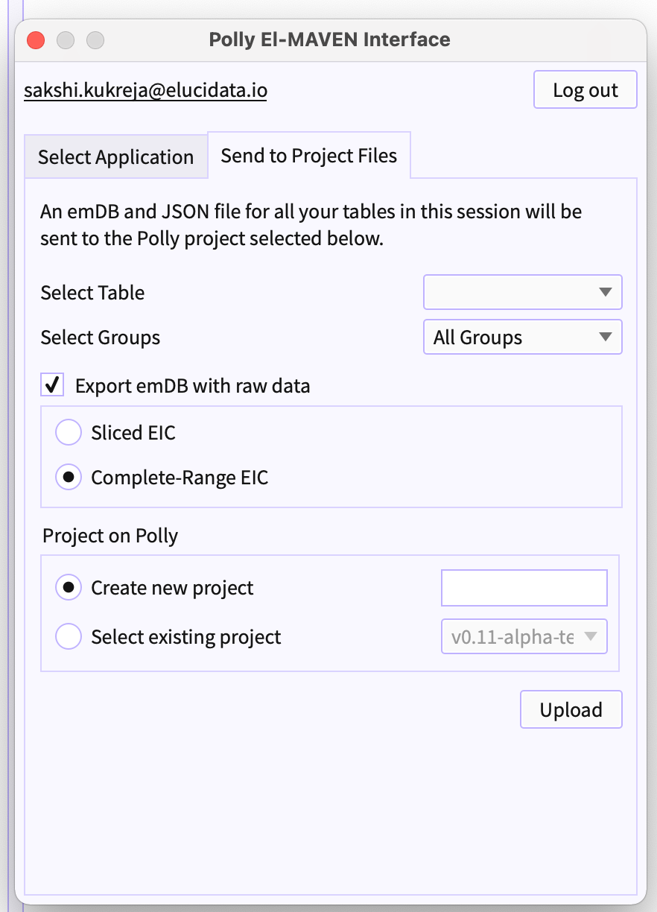 
**Figure 25.** Polly El-MAVEN Interface
  

* *Send to Project Files* is the tab on EPI to send session files to Polly workspaces.

    * Select Table (refer to figure 25) - From the dropdown beside 'Select Table' choose the table that you would like to export to polly. 

    * Select Groups - You can filter out peakgroups that you want to export to Polly.

        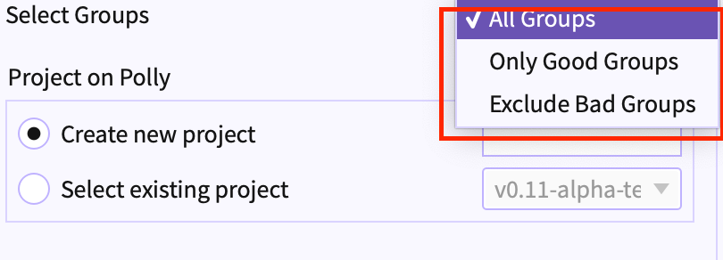 
**Figure 26.** Select the groups type
  

        * All Groups - Exports all the groups that are there in a peaktable.

        * Only good groups - Exports all the groups that are marked as good or signals by peakML. 

        * Only bad groups - Export all the groups that are marked as bad or noise by peakML.

    * Export emDB with raw data (refer to figure 25) - Select the checkbox if you wish to export emDB as raw files. 
        
        * Choose the options of slices and complete-range EIC

    * Project on Polly (refer to figure 25) - You can choose two of the given options for selecting the project. Either you can create a new project and export the files in the newly created project or you can select the existing workspace and upload the session files in selected workspace.

#Note     

* To access Polly-PeakML, a user must be licensed to PeakML models that are proprietary to the organisation.

##Frequently Asked Questions (FAQs)

| **S.No.** | **Questions** | **Answers** |
| --- | --- | --- |
|1.| **What is peak curation?** | Metabolities in biological samples are run through chromatrographic columns and then detected by a mass spectrometer. The resultant data is then read in tools such as El-MAVEN which has algorithms for automatically detecting signals (untargeted approach) in this data that we visualise as peaks having varying intensities. Depending on the threshold set for detection, one would also detect noise amongst these signals. This is where experts systematically go through the detected peak-groups and curate them as good peak groups/ bad peak groups.|
|2.| **Why do we need an ML model for peak-curation?** |Reasons for the need of ML model - Inherent noise in metabolomics datasets; Differences in expert opinions; Manual curation is long and tedious.|
|3.| **Why do we need Polly credentials?** |Polly-PeakMl models are proprietary to the organisation. Only the users licensed to use PeakML can access it.|
|4.| **Is it necessary to provide cohort information?** |Yes, Polly-PeakML makes it a compulsion for the users to enter the cohort information for the samples that are uploaded.|
|5.| **How can I book a demo for Polly-PeakMl?** |Email us at *polly@elucidata.io*|

    

