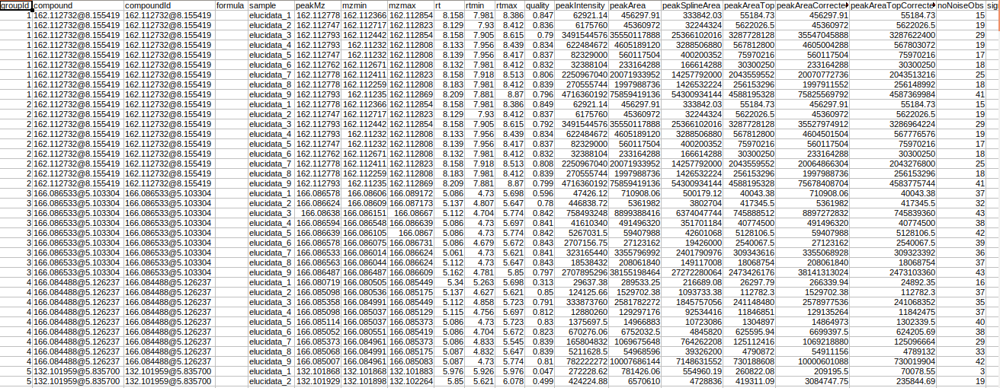
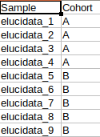
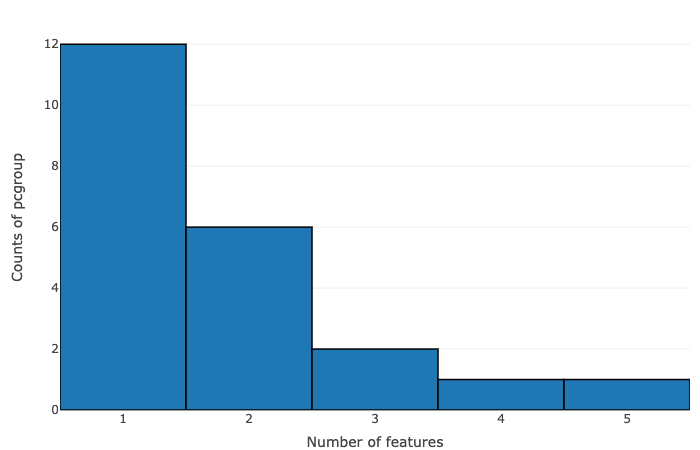
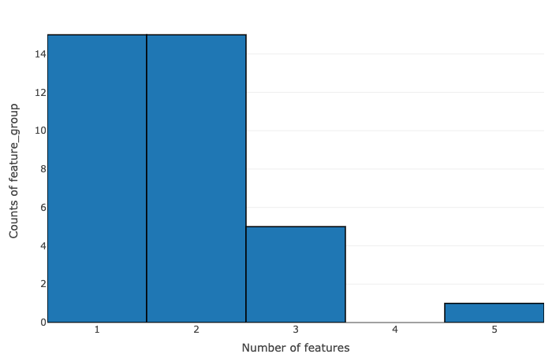
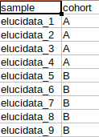

#Introduction

##Overview

Untargeted Metabolomics, otherwise known as discovery metabolomics, analyzes the metabolomic profile globally from each sample thus producing voluminous and complex data. This needs robust bioinformatics tools to help meaningfully interpret this data. The Untargeted Pipeline enables you to perform the annotation and identification of the metabolites, PCA and differential expression using limma. It uses [CAMERA](https://www.ncbi.nlm.nih.gov/pubmed/22111785), a package built for annotation of the adducts, isotopes, fragments and then maps features to a reference compound database (KEGG, HMDB or a custom database). The workflow begins with automated peak curation on [El-MAVEN](https://resources.elucidata.io/elmaven) using the Untargeted algorithm and the peak table derived from this is used as input for PollyTM Untargeted  Pipeline.

##Scope of the app

*   Annotate adducts, isotopes and fragments in the data and identify metabolites
*   Perform differential expression
*   Generate input for [MetScape](../MetScape) to perform pathway analysis

**Figure 1.** Untargeted Pipeline

#Getting Started

##User Input

Untargeted Pipeline requires the following two files as input:

**Intensity File**

The intensity file used here is the El-MAVEN output in peak detailed format. This output contains unannotated features along with their retention time and m/z information. 

**Figure 2.** El-MAVEN intensity file

**Cohort FIle**

The cohort file should be in .csv format as shown in Figure 3. This file should contain two columns, *Sample* containing sample names along with *Cohort* for its cohort information.

**Figure 3.** Cohort file

##Steps involved in data processing

*   Process raw data on El-MAVEN using automated feature detection.
*   Export intensity file in peak detailed format and prepare metadata file.
*   Annotate adducts, isotopes and fragments in the data.
*   Perform identification of metabolites.
*   Perform differential expression using limma visualize results.
*   Generate MetScape input to perform pathway analysis.

##Caveats

*   The input file should be the peak detailed output of El-MAVEN.

#Tutorial

Go to the dashboard and select Untargeted Pipeline under the *Metabolomcis Data* tab.

**Figure 4.** Polly Dashboard

**Figure 5.** Untargeted Pipeline

##Uplaod Files

The upload data tab allows you to upload El-MAVEN output and the cohort file up to 100MB. Upload the intensity and cohort file using the drop downs shown below, select the polarity of the data and then click on *Load Data* to proceed.

**Figure 6.** Upload files

##Annotation

For annotation, we use the R package, CAMERA. It takes the output in peak detailed format from El-MAVEN which contains. The file should contain *mzmin* and *mzmax* details in the file.

**CAMERA**

CAMERA operates in the following steps:

*   First it groups the features by their retention time
*   It then forms groups by correlation inside samples (EIC) or correlation across samples or both
*   After grouping these features, it annotates the possible isotopes and adducts.

**Figure 7.** Annotation

**Advanced parameters**

The following parameters need to be set before running CAMERA:

*   **cor_exp_th:** Correlation threshold for EIC correlation (Range: 0-1)
*   **pval:** *p*-value threshold for testing correlation of significance (Range: 0-1)
*   **perfwhm:** percentage of FWHM (Full Width at Half Maximum) width used in "*groupFWHM*" function for grouping features
*   **sigma:**  multiplier of the standard deviation used in "*groupFWHM*" function for grouping features
*   **calccis:** Use correlation inside samples for peak grouping (TRUE/FALSE)
*   **calccas:** Use correlation across samples for peak grouping (TRUE/FALSE)
*   **max_iso:** maximum number of expected isotopes (0-8)
*   **minfrac:** The percentage number of samples, which must satisfy the C12/C13 rule for isotope annotation
*   **ppm:** General ppm error
*   **mzabs:** General absolut error in m/z
*   **multiplier:** If no ruleset is provided, calculate ruleset with max. number n of [nM+x] clusterions
*   **max_peaks:** How much peaks will be calculated in every thread using the parallel mode
*   **maxcharge:** maximum ion charge

**Figure 8.** Advanced parameters

**Select adducts for annotation**

You can select adducts that are needed for annotation.

*   **Available Adducts Rules:** The default adduct rules file is present which can be used for annotation.
*   **Upload Custom Adducts Rules:** You can upload the custom adducts rules file otherwise.
*   The adducts rules file has the following columns:

    *   *name:* adduct name
    *   *nmol:* Number of molecules (xM) included in the molecule
    *   *charge:* charge of the molecule
    *   *massdiff:* mass difference without calculation of charge and nmol (CAMERA will do this automatically)
    *   *oidscore:* This score is the adduct index. Molecules with the same cations (anions) configuration and different nmol values have the same oidscore, such as [M+H] and [2M+H]
    *   *quasi:* Every annotation which belongs to one molecule is called annotation group. Examples for these are [M+H] and [M+Na], where M is the same molecule. An annotation group must include at least one ion with quasi set to 1 for this adduct. If an annotation group only includes optional adducts (rule set to 0) then this group is excluded. To disable this reduction, set all rules to 1 or 0.
    *   *ips:* This is the rule score. If a peak is related to more than one annotation group, then the group having a higher score (sum of all annotations) gets picked. This effectively reduces the number of false positives.

**Figure 9.** Select adducts for annotation

**CAMERA output table**

After annotation CAMERA adds three columns i.e. isotopes, adducts and pcgroup. The isotopes column contains the annotation for the isotopes where annotation is in the format of "[id][isotope]charge" for example [1][M]+, [1][M+1]+, [2][M+3]+. 

The adduct column contains the annotation for the adducts where annotation is in the format of "[adduct] charge basemass" for example [M+H]+ 161.105, [M+K]+ 123.15 etc. The pcgroup column contains the ‘pseudospectra’ which means features are grouped based on rt and correlation (inside and across samples).

**Figure 10.** CAMERA output table

**Restructured CAMERA output table**

The features in the CAMERA output are not grouped together according to the *pcgroup* because it only appends the new columns in the existing feature table without changing the order of the features and also features which are different molecules may have the same *pcgroup*. So to interpret the results better it is necessary to separate the features which belong to different molecules within the same *pcgroup*.

To overcome the above problem, there is another label of grouping based on the features belonging to the same molecule. The other label of grouping is done by assuming that the features which are representing the same molecule should have the same basemass.

The following operations are performed to make the restructured CAMERA output:

*   The *adduct* column is split into two new columns i.e. *adduct_type* and *basemass*. If any feature has more than one combination of *adduct_type* and *basemass* for example "[M+K]+ 123.15 [M+Na]+ 139.124 [M+H]+ 161.105" then they are split into separate rows having other information same.

*   The *isotopes* column is split into two new columns i.e. *isotope_id* and *isotope_type*.

*   A new column *feature_group* is added in the existing table where each value represents a different molecule. The *feature_group* column is filled based on the following assumptions:

    *   Features having basemass will have the same *feature_group* id.

    *   Those features which do not have the adducts (which CAMERA could not annotate) will be filled by [M+H]+ (in positive mode) or [M-H]- (in negative mode) as adduct and based on this adduct information the *adduct_type* and *basemass* columns will be filled.

    *   Features having the same isotope_id will be grouped in the same *feature_group* id.

    *   The same *pcgroup* may have more than one feature_group ids if it has more than one molecule.

**Figure 11.** Restructured CAMERA ouput table

**Representatiove output table**

After restructuring the CAMERA output it is necessary to define the representative feature from the features belonging to the same feature_group id because since these features belong to the same molecule so there is no need to include all features in the identification step. 

The representative feature is defined based on the following assumptions:

*   If the feature group has only one feature then that feature will be considered as the representative feature.

*   The feature group has more than one feature then the representative feature will be determined by the following criteria:

    *   If the feature group has [M+H] (in positive mode) or [M-H] (in negative mode) then that feature will be considered as the representative feature. 

    *   If the feature group does not have [M+H] (in positive mode) or [M-H] (in negative mode) then that feature will be considered as representative whose sum of intensity across all samples is maximum.

**Figure 12.** Representative CAMERA ouput table

**Summary of annotation**

The data is summarized on the basis of the number of features within *pcgroup* and feature group:

*   Number of features vs counts of *pcgroup*

**Figure 13.** Number of features vs counts of *pcgroup*

*   Number of features vs counts of feature groups

**Figure 14.** Number of features vs counts of feature groups

##Identification

The identification is performed on the representative table only. The representative features are searched against the compound database uploaded. 

It uses the *basemass* instead mZ for mass searching because adducts and isotopes are already filtered in the above steps.

 <!-- **Figure 8.** Advanced parameters --> 

**Figure 15.** Identification

**Representative metabolite identification table**

The representative table is appended by the compound database columns after identification.

**Figure 16.** Representative metabolite identification table

**Overall metabolite identification table**

The representative metabolite identification table is again merged to the restructured camera output.

**Figure 17.** Overall metabolite identification table

**[MetScape](../MetScape) input**

The results are generated in the MetScape input intensity format and metadata format.

**Figure 18.** MetScape intensity file

**Figure 19.** MetScape cohort file

##Quality check

This allows you to understand the clustering pattern between biologically grouped and ungrouped samples.

**Figure 20.** Quality check

##Statistical analysis

This interface allows you to perform differential expression analysis with the aim to identify metabolites whose expression differs between any specified cohort conditions. The 'limma' R package is used to identify the differentially expressed metabolites. This method creates a log2 fold change ratio between the two experimental conditions and an adjusted *p*-value that rates the significance of the difference.

The following parameters are available for selection:

*   Select *Cohort A* and *Cohort B*: Default values are filled automatically for a selected cohort condition, which can be changed as per the cohorts of interest.

*   Select *p-val* or *adj. p-val*: Select either *p*-value or adj. *p*-value for significance.

*   *p-val* or *adj. p-val* cutoff: By default, the value is 0.05 but can be changed if required.

*   *log2FC*: Specify the cut-off for log2 fold change with the help of the slider.

Based on the parameters specified, a volcano plot is displayed. The volcano plot helps in visualizing metabolites that are significantly dysregulated between two cohorts.

**Figure 21.** Stastical analysis

#References

*   CAMERA: An Integrated Strategy for Compound Spectra Extraction and Annotation of Liquid Chromatography/Mass Spectrometry Data Sets Anal. Chem. 2012, 84, 1, 283-289