#Introduction

##Overview

The recent development of various omics technologies in biology has increased the systems level analytical methods. It includes complete genome, transcriptome, proteome and metabolome analysis with various high-throughput technologies, including microarrays, Next-Generation Sequencing (NGS) and mass spectrometry. Multi-omics data integration provides an opportunity to understand the cellular or tissue level environment as a whole. IntOmix is an application specifically geared towards integrated network analysis of multi-omics with a focus on the identification of significantly changing metabolic network modules between two experimental conditions. The integration of the data generated by these two approaches can give simultaneous information about metabolomic changes along with the transcriptional changes.

##Scope of the App

*   Go from differentially expressed data to visualisations of pathway-level changes in less than 5 minutes.
*   Process single or multi-omics data.
*   Search for publications based on keywords added and significantly perturbed genes or metabolites by adding/editing keywords before or after optimization.
*   Compare insights obtained from the data with existing literature.
*   Compare results obtained from the same data at different parameters.
*   Download results as publication-quality figures in various formats such as .png, .jpeg, .pdf or .xgmml.

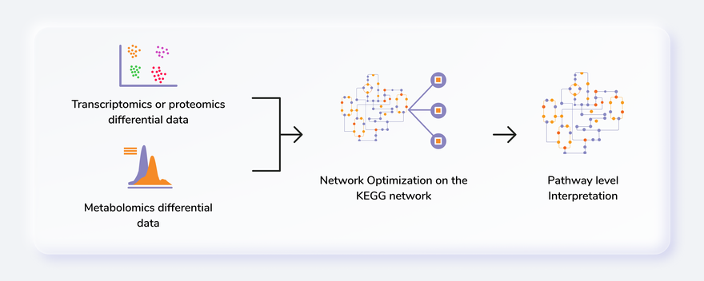 
**Figure 1.** IntOmix

#Getting Started

##User input

IntOmix requires two types of .csv input files:

*   Metabolite differential expression file
*   Gene differential expression file

Both the input files consist of information about log2 fold change and the *p*-value of each gene or metabolite. In case of comparisons between multiple cohorts, you can also provide the name of the cohorts in the columns *state1* and *state2* as shown in Figure 2. You can also use files without the cohort information as shown in Figure 3.

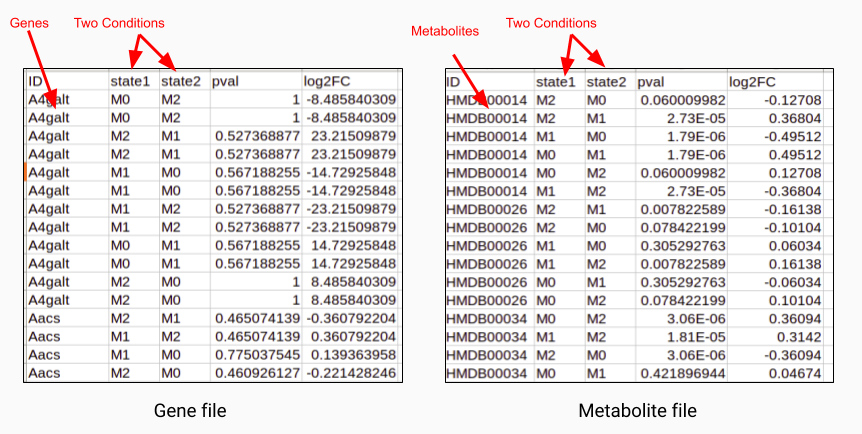 
**Figure 2.** Sample input files

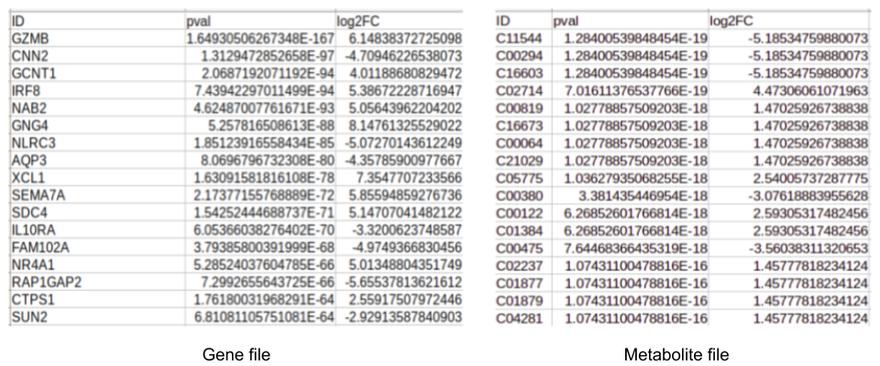 
**Figure 3.** Files without cohort information

##Steps in data processing

*   Upload differentially expressed metabolomics/transcriptomics/genomics files.
*   Set parameters to perform the optimization of the network.
*   Perform Pathway Enrichment analysis.
*   Perform cross-cohort comparison to find common genes and metabolites across the various analysis.

**Note:**

*   You can run the app using any single file as input if required.

## Caveats

*   KEGG or HMDB ID for metabolites and gene id for genes is required to map these on the pathway map.
*   If *state 1* and *state 2* columns are not present in the input files, the entire data will be treated as if from one comparison with the default cohort names, *Cohort1* and *Cohort2*.
*   In case there are blank cells for *p*-value or log2 fold change in the input files, the corresponding metabolites or genes are dropped before optimization and a notice is shown to that effect.
*   Currently, we only support reactions from *Homo sapiens*, *Mus musculus* and *Drosophila melanogaster*.
*   At a time only one keyword can be annotated as the primary keyword.
*   Publication Search module requires at least one keyword to be annotated as the primary keyword.
*   To utilize the Cross Cohort Comparison functionality, run your analysis at least twice at different parameters.

#Tutorial

Select *IntOmix* from the dashboard under the *Multi-omic Data* Tab as shown in Figure 4. Create a *New Workspace* or choose an existing one from thr drop-down and provide a *Name of the Session* to be redirected to IntOmix's upload page.

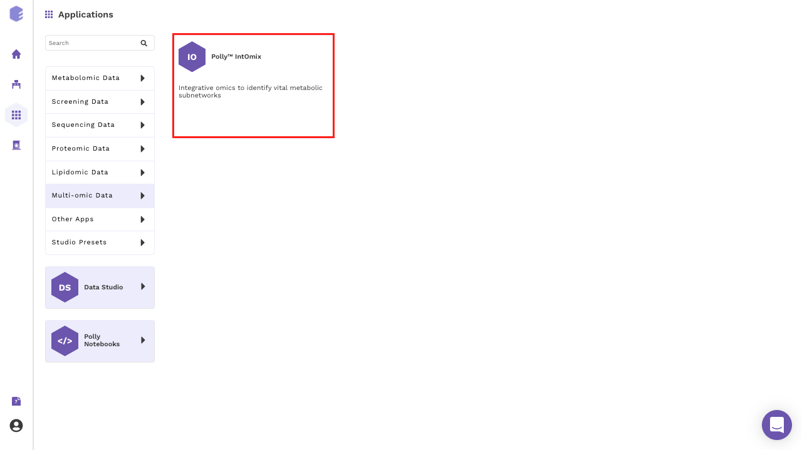

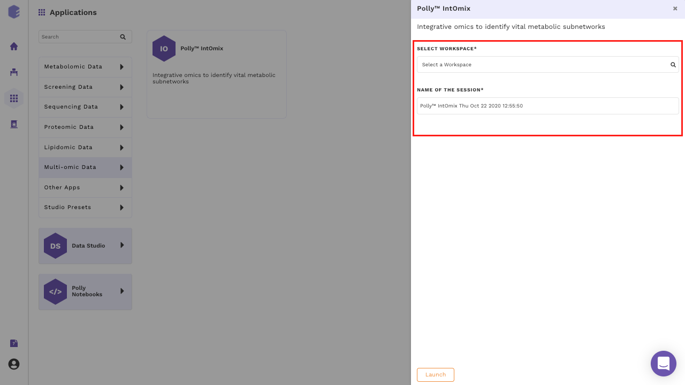 
**Figure 4.** Polly Dashboard and Workspace selection

##Upload files

The file upload interface allows you to upload input files to be processed in IntOmix as shown in Figure 5.

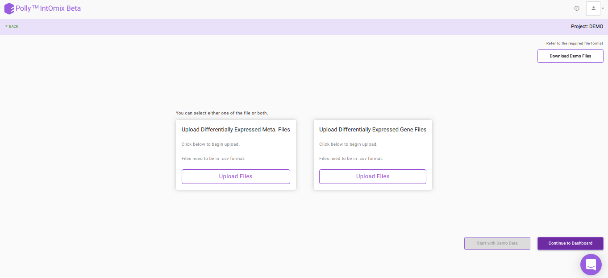 
**Figure 5.** File Upload interface

Click on *Upload .csv Files* to upload the differential expression files in the format mentioned above and then click on *Continue to Dashboard.*

##Parameter Interface

This interface allows you to adjust parameters to be used to generate the optimized network.

*   You can select cohorts as per your requirements.
*   The organism will be detected automatically based on data input if the gene file has been uploaded.
*   You can either proceed with the default parameters or specify the values. To know more about the significance of the parameters, refer to the [Details of the App](https://docs.elucidata.io/Apps/Multi-omic%20Data/IntOmix.html#details-about-the-app) section.
*   To isolate keywords from a paragraph, copy it on the left side of the *Add Keywords* section and click on *Filter Keywords*. The isolated keywords will be displayed below.
*   To add specific keywords, write them on the right side of the *Add Keywords* section separated by a comma and click on Add Keywords.
*   Click on any particular keyword to annotate it as the primary keyword. The primary keyword selection can be changed on the next interface as well as we can see in Figure 6.
*   After specifying all the required parameters, click on *Get Started* to process your data.

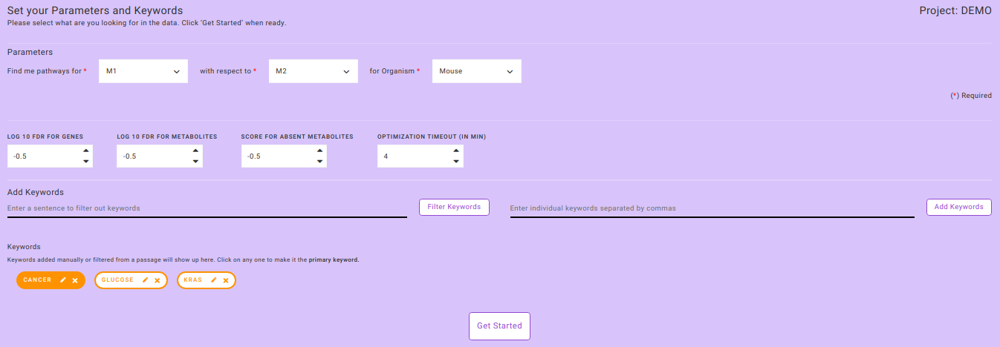 
**Figure 6.** Set parameter interface

**Note:**

*   Processing of data requires as much time as specified to optimize the significantly perturbed networks present in the data.

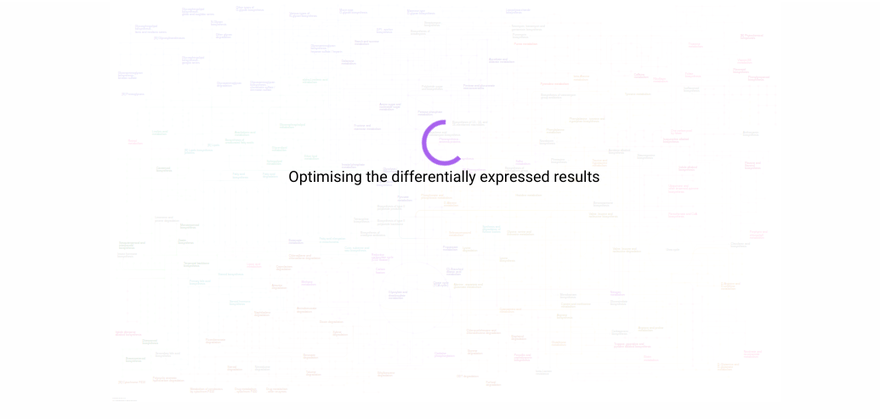 
**Figure 7.** Optimization and map generation

##Pathway Dashboard

After data processing, a KEGG map is generated based on the input parameters. The most significantly changing genes and metabolites between the two conditions are captured in the form of a network module. This network module is overlaid on the KEGG pathway to effectively visualize the overall topology of the variations between the two conditions. Hovering on any node or edge will display a dialog box with information about the selected gene or metabolite as shown in Figure 8. You can also zoom in, zoom out, select nodes or edges on the interactive map or download it in one of the several formats available.

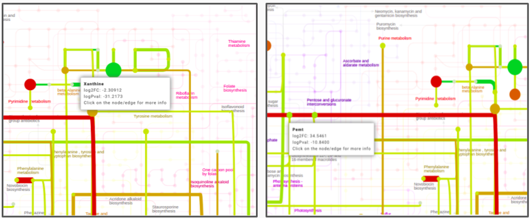 
**Figure 8.** Hovering on metabolites and genes provides further information.

You can add all metabolites and genes which do not satisfy the parameters specified for the optimized network.

##Option and Information

In the *Option & Information* pop-up window as shown in Figure 9, you can select *All Others* option to add all genes and metabolites in the data to the generated map. The genes and metabolites have color ranging from red-green scale . All upregulated metabolites or genes are represented by a shade of red and downregulated metabolites or genes as a shade of green. The missing metabolites and genes are represented by shade of blue.

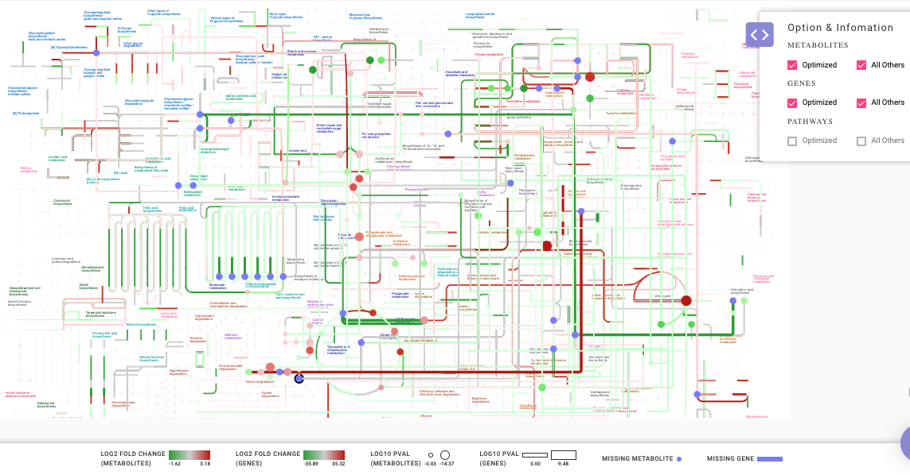 
**Figure 9.** Pathway map containing all metabolites and genes in the input files.

##Analyze your data

After the KEGG network is created, the predefined set of queries can be selected from *Analyze your Data* option which gives you more insights on the results derived.

**What are the key pathways?**

This option enables you to find the key pathways that are perturbed in the data. The results of this query are based on two scoring methods; pathway enrichment and topology analysis. Pathway enrichment analysis refers to the quantitative approach based on the concentration of metabolites present. Gene set enrichment analysis is one of the famous algorithms used for enrichment analysis. In PollyTM IntOmix, R packages such as *globaltest* and *GlobalAncova* are used to analyze the pathway enrichment. Similarly, for topology analysis, betweenness centrality and degree centrality are considered as key parameters to find the most influential and important pathways in the whole subnetwork.

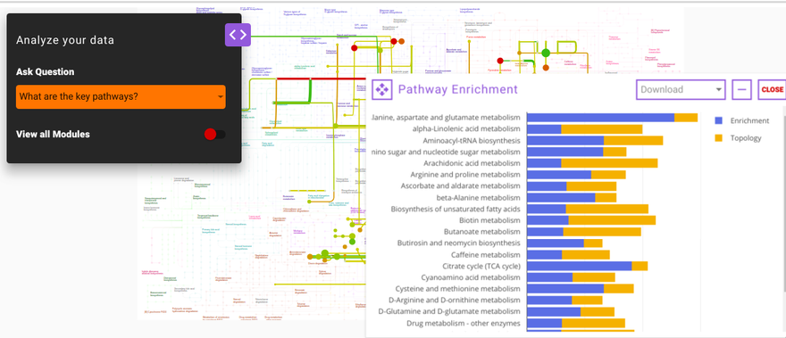 
**Figure 10.** Pathway Enrichment module

**How do publicly available results correlate with my results?**

This question enables you to select any gene or metabolite that is significantly differentially expressed in their data along with the specified primary keyword. Using both of these as the input, IntOmix will display a list of relevant publications that you can read more to gain insights about their data and generate hypotheses.

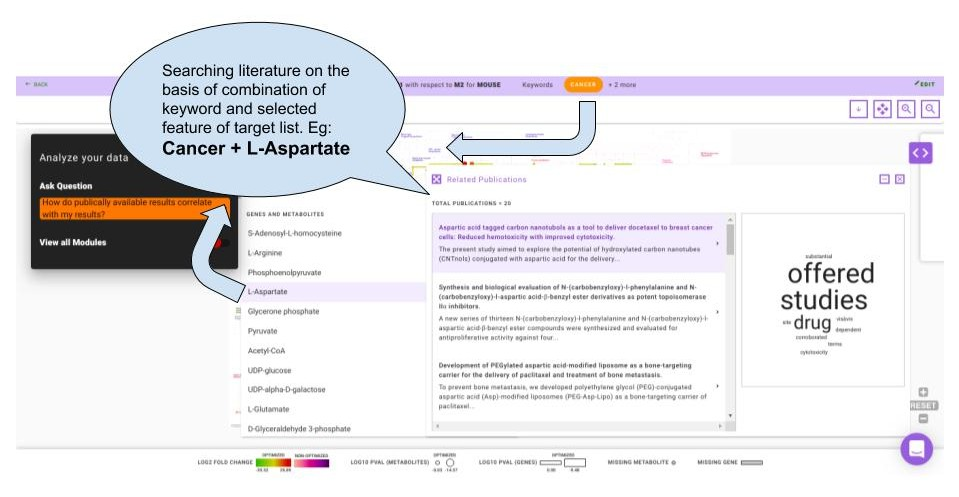 
**Figure 11.** Publication Search module.

**How do my other comparisons compare with my results?**

Using this question you can compare the analysis of the same data using different parameters. The output of this question is displayed as a Venn diagram wherein the intersection contains the common genes and metabolites found in both the set of analyses. This helps you understand how a single parameter or a group of parameters affect their analysis.

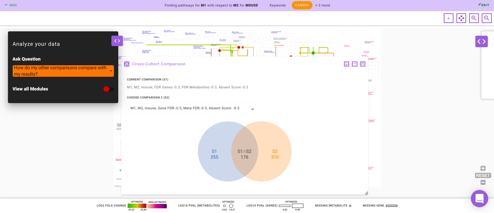 
**Figure 12.** Cross Cohort Comparison

Watch the demo video below for more information.

    <iframe src="https://www.youtube.com/embed/ISsKc81FQqM" frameborder="0" allowfullscreen style="position: absolute; top: 0; left: 0; width: 100%; height: 100%;"></iframe>

 

#Details about the app

IntOmix is based on [CoMBI-T](https://www.cell.com/immunity/fulltext/S1074-7613(15)00080-1?_returnURL=https%3A%2F%2Flinkinghub.elsevier.com%2Fretrieve%2Fpii%2FS1074761315000801%3Fshowall%3Dtrue) i.e., Concordant Metabolomics Integration with Transcription pipeline to utilize the multiple omics techniques (metabolomics and transcriptomics) to focus on the identification of significantly altering metabolic network modules between two experimental conditions under investigation. This network includes both metabolites and enzymes. The most co-ordinately responsive sub-network is identified using the integrated network analysis and also, the novel points of metabolic rewiring are revealed.

##Finding a module

After making a network, one can find a connected module that contains the most significantly changed genes and metabolites. Internally, this is done by first scoring nodes and edges based on their *p*\-values in such a way that positive scores correspond to significant *p*-values and negative scores correspond to insignificant changes. Then the problem of finding a connected subgraph with maximum summary weight is solved.

The *FDR values* and *Score for absent metabolites* options control the size of the module. Increasing/decreasing the *FDR for reactions* (*FDR for metabolites*) value makes adding reactions (metabolites) to a module easier/harder.

It is recommended to start from the default values and then gradually change them depending on the results. Default FDR values are generated so that the module will be the size of ~100 reactions.

#Videos

    <iframe src="https://www.youtube.com/embed/Qhdp82moWsQ" frameborder="0" allowfullscreen style="position: absolute; top: 0; left: 0; width: 100%; height: 100%;"></iframe>

 

#References

*   Sergushichev, Alexey A., et al. "GAM: a web-service for integrated transcriptional and metabolic network analysis." Nucleic acids research 44.W1 (2016): W194-W200.
*   Goeman, Jelle J., and Peter Bühlmann. "Analyzing gene expression data in terms of gene sets: methodological issues." Bioinformatics 23.8 (2007): 980-987.
*   Hummel, Manuela, Reinhard Meister, and Ulrich Mansmann. "GlobalANCOVA: exploration and assessment of gene group effects." Bioinformatics 24.1 (2007): 78-85.
*   Jha, Abhishek K., et al. "Network integration of parallel metabolic and transcriptional data reveals metabolic modules that regulate macrophage polarization." *Immunity* 42.3 (2015): 419-430.

#Frequently Asked Questions (FAQs)

<table data-number-column="false" style="margin: 24px 0px 0px; border-collapse: collapse; width: 679px; border: 1px solid rgb(193, 199, 208); table-layout: fixed;" data-mkd-display="block" data-mkd-tablehasheader="false"><colgroup style="box-sizing: border-box;" data-mkd-display="block"><col style="box-sizing: border-box; width: 51px;" data-mkd-display="block"><col style="box-sizing: border-box; width: 225px;" data-mkd-display="block"><col style="box-sizing: border-box; width: 402px;" data-mkd-display="block"></colgroup><tbody style="border-bottom: none; box-sizing: border-box;" data-mkd-display="block"><tr style="box-sizing: border-box;" data-mkd-display="block" data-mkd-index="1" data-mkd-index-row="1"><th rowspan="1" colspan="1" class="ak-renderer-tableHeader-sortable-column" data-colwidth="58" style="border-width: 1px 0px 0px 1px; border-style: solid; border-color: rgb(193, 199, 208); border-image: initial; padding: 8px; text-align: left; vertical-align: top; box-sizing: border-box; min-width: 48px; font-weight: normal; background-clip: padding-box; background-color: rgb(240, 240, 240); cursor: pointer; position: relative;" data-mkd-display="block" data-mkd-index="1" data-mkd-index-cell="1">
<strong style="box-sizing: border-box;" data-mkd-display="inline">S. No.</strong>
<figure class="ak-renderer-tableHeader-sorting-icon ak-renderer-tableHeader-sorting-icon__no-order" style="box-sizing: border-box; margin: 0px; opacity: 0; transition: opacity 0.2s ease-in-out 0s;" data-mkd-display="block">
<figure class="sc-lnmtFM fvkDRB" style="display: flex; position: absolute; height: 28px; width: 28px; margin: 6px; right: 0px; top: 0px; border: 2px solid rgb(255, 255, 255); border-radius: 4px; background-color: rgb(244, 245, 247); -webkit-box-pack: center; justify-content: center; -webkit-box-align: center; align-items: center; box-sizing: border-box;" data-mkd-display="block"><svg width="8" height="12" class="sorting-icon-svg__no_order" fill-opacity="0.5" data-mkd-display="block"><g fill="none" fill-rule="evenodd" data-mkd-display="block"><path d="M-8-6h24v24H-8z" data-mkd-display="block"></path><path d="M3 8.509V1c0-.552.449-1 1-1 .552 0 1 .448 1 1V8.51l1.217-1.206a1.05 1.05 0 011.477 0 1.03 1.03 0 01.004 1.463l-.003.002-2.956 2.93a1.053 1.053 0 01-1.478 0L.305 8.767a1.03 1.03 0 01.001-1.464 1.05 1.05 0 011.477 0L3 8.508z" fill="#42526E" data-mkd-display="block"></path></g></svg></figure>
</figure></th><th rowspan="1" colspan="1" class="ak-renderer-tableHeader-sortable-column" data-colwidth="252" style="border-width: 1px 0px 0px 1px; border-style: solid; border-color: rgb(193, 199, 208); border-image: initial; padding: 8px; text-align: left; vertical-align: top; box-sizing: border-box; min-width: 48px; font-weight: normal; background-clip: padding-box; background-color: rgb(240, 240, 240); cursor: pointer; position: relative;" data-mkd-display="block" data-mkd-index="2" data-mkd-index-cell="2">
<strong style="box-sizing: border-box;" data-mkd-display="inline">Question</strong>
<figure class="ak-renderer-tableHeader-sorting-icon ak-renderer-tableHeader-sorting-icon__no-order" style="box-sizing: border-box; margin: 0px; opacity: 0; transition: opacity 0.2s ease-in-out 0s;" data-mkd-display="block">
<figure class="sc-lnmtFM fvkDRB" style="display: flex; position: absolute; height: 28px; width: 28px; margin: 6px; right: 0px; top: 0px; border: 2px solid rgb(255, 255, 255); border-radius: 4px; background-color: rgb(244, 245, 247); -webkit-box-pack: center; justify-content: center; -webkit-box-align: center; align-items: center; box-sizing: border-box;" data-mkd-display="block"><svg width="8" height="12" class="sorting-icon-svg__no_order" fill-opacity="0.5" data-mkd-display="block"><g fill="none" fill-rule="evenodd" data-mkd-display="block"><path d="M-8-6h24v24H-8z" data-mkd-display="block"></path><path d="M3 8.509V1c0-.552.449-1 1-1 .552 0 1 .448 1 1V8.51l1.217-1.206a1.05 1.05 0 011.477 0 1.03 1.03 0 01.004 1.463l-.003.002-2.956 2.93a1.053 1.053 0 01-1.478 0L.305 8.767a1.03 1.03 0 01.001-1.464 1.05 1.05 0 011.477 0L3 8.508z" fill="#42526E" data-mkd-display="block"></path></g></svg></figure>
</figure></th><th rowspan="1" colspan="1" class="ak-renderer-tableHeader-sortable-column" data-colwidth="449" style="border-width: 1px 0px 0px 1px; border-style: solid; border-color: rgb(193, 199, 208); border-image: initial; padding: 8px; text-align: left; vertical-align: top; box-sizing: border-box; min-width: 48px; font-weight: normal; background-clip: padding-box; background-color: rgb(240, 240, 240); cursor: pointer; position: relative;" data-mkd-display="block" data-mkd-index="3" data-mkd-index-cell="3" data-mkd-pos="last">
<strong style="box-sizing: border-box;" data-mkd-display="inline">Answer</strong>
<figure class="ak-renderer-tableHeader-sorting-icon ak-renderer-tableHeader-sorting-icon__no-order" style="box-sizing: border-box; margin: 0px; opacity: 0; transition: opacity 0.2s ease-in-out 0s;" data-mkd-display="block">
<figure class="sc-lnmtFM fvkDRB" style="display: flex; position: absolute; height: 28px; width: 28px; margin: 6px; right: 0px; top: 0px; border: 2px solid rgb(255, 255, 255); border-radius: 4px; background-color: rgb(244, 245, 247); -webkit-box-pack: center; justify-content: center; -webkit-box-align: center; align-items: center; box-sizing: border-box;" data-mkd-display="block"><svg width="8" height="12" class="sorting-icon-svg__no_order" fill-opacity="0.5" data-mkd-display="block"><g fill="none" fill-rule="evenodd" data-mkd-display="block"><path d="M-8-6h24v24H-8z" data-mkd-display="block"></path><path d="M3 8.509V1c0-.552.449-1 1-1 .552 0 1 .448 1 1V8.51l1.217-1.206a1.05 1.05 0 011.477 0 1.03 1.03 0 01.004 1.463l-.003.002-2.956 2.93a1.053 1.053 0 01-1.478 0L.305 8.767a1.03 1.03 0 01.001-1.464 1.05 1.05 0 011.477 0L3 8.508z" fill="#42526E" data-mkd-display="block"></path></g></svg></figure>
</figure></th></tr><tr style="box-sizing: border-box;" data-mkd-display="block" data-mkd-index="2" data-mkd-index-row="2"><td rowspan="1" colspan="1" data-colwidth="58" style="border-width: 1px 0px 0px 1px; border-style: solid; border-color: rgb(193, 199, 208); border-image: initial; padding: 8px; box-sizing: border-box; min-width: 48px; vertical-align: top; background-clip: padding-box;" data-mkd-display="block" data-mkd-index="1" data-mkd-index-cell="1">
1.
</td><td rowspan="1" colspan="1" data-colwidth="252" style="border-width: 1px 0px 0px 1px; border-style: solid; border-color: rgb(193, 199, 208); border-image: initial; padding: 8px; box-sizing: border-box; min-width: 48px; vertical-align: top; background-clip: padding-box;" data-mkd-display="block" data-mkd-index="2" data-mkd-index-cell="2">
<strong style="box-sizing: border-box;" data-mkd-display="inline">What is PollyTM&nbsp;IntOmix?</strong>
</td><td rowspan="1" colspan="1" data-colwidth="449" style="border-width: 1px 0px 0px 1px; border-style: solid; border-color: rgb(193, 199, 208); border-image: initial; padding: 8px; box-sizing: border-box; min-width: 48px; vertical-align: top; background-clip: padding-box;" data-mkd-display="block" data-mkd-index="3" data-mkd-index-cell="3" data-mkd-pos="last">
PollyTM&nbsp;IntOmix is an application specifically geared towards integrated network analysis of multi-omics with a focus on the identification of significantly changing metabolic network modules between two experimental conditions.
</td></tr><tr style="box-sizing: border-box;" data-mkd-display="block" data-mkd-index="3" data-mkd-index-row="3"><td rowspan="1" colspan="1" data-colwidth="58" style="border-width: 1px 0px 0px 1px; border-style: solid; border-color: rgb(193, 199, 208); border-image: initial; padding: 8px; box-sizing: border-box; min-width: 48px; vertical-align: top; background-clip: padding-box;" data-mkd-display="block" data-mkd-index="1" data-mkd-index-cell="1">
2.
</td><td rowspan="1" colspan="1" data-colwidth="252" style="border-width: 1px 0px 0px 1px; border-style: solid; border-color: rgb(193, 199, 208); border-image: initial; padding: 8px; box-sizing: border-box; min-width: 48px; vertical-align: top; background-clip: padding-box;" data-mkd-display="block" data-mkd-index="2" data-mkd-index-cell="2">
<strong style="box-sizing: border-box;" data-mkd-display="inline">How can I test&nbsp;PollyTM&nbsp;IntOmix if I don't have my own data?</strong>
</td><td rowspan="1" colspan="1" data-colwidth="449" style="border-width: 1px 0px 0px 1px; border-style: solid; border-color: rgb(193, 199, 208); border-image: initial; padding: 8px; box-sizing: border-box; min-width: 48px; vertical-align: top; background-clip: padding-box;" data-mkd-display="block" data-mkd-index="3" data-mkd-index-cell="3" data-mkd-pos="last">
You can download the demo data set by clicking on the Download Demo Files button on&nbsp;PollyTM&nbsp;IntOmix Upload page.
</td></tr><tr style="box-sizing: border-box;" data-mkd-display="block" data-mkd-index="4" data-mkd-index-row="4"><td rowspan="1" colspan="1" data-colwidth="58" style="border-width: 1px 0px 0px 1px; border-style: solid; border-color: rgb(193, 199, 208); border-image: initial; padding: 8px; box-sizing: border-box; min-width: 48px; vertical-align: top; background-clip: padding-box;" data-mkd-display="block" data-mkd-index="1" data-mkd-index-cell="1">
3.
</td><td rowspan="1" colspan="1" data-colwidth="252" style="border-width: 1px 0px 0px 1px; border-style: solid; border-color: rgb(193, 199, 208); border-image: initial; padding: 8px; box-sizing: border-box; min-width: 48px; vertical-align: top; background-clip: padding-box;" data-mkd-display="block" data-mkd-index="2" data-mkd-index-cell="2">
<strong style="box-sizing: border-box;" data-mkd-display="inline">Can I run PollyTM IntOmix if I only have the metabolomics or transcriptomics data?</strong>
</td><td rowspan="1" colspan="1" data-colwidth="449" style="border-width: 1px 0px 0px 1px; border-style: solid; border-color: rgb(193, 199, 208); border-image: initial; padding: 8px; box-sizing: border-box; min-width: 48px; vertical-align: top; background-clip: padding-box;" data-mkd-display="block" data-mkd-index="3" data-mkd-index-cell="3" data-mkd-pos="last">
Yes. Even though PollyTM IntOmix is designed for integrating multi-omics data, you can run the metabolomics or transcriptomics data by itself.
</td></tr><tr style="box-sizing: border-box;" data-mkd-display="block" data-mkd-index="5" data-mkd-index-row="5"><td rowspan="1" colspan="1" data-colwidth="58" style="border-width: 1px 0px 0px 1px; border-style: solid; border-color: rgb(193, 199, 208); border-image: initial; padding: 8px; box-sizing: border-box; min-width: 48px; vertical-align: top; background-clip: padding-box;" data-mkd-display="block" data-mkd-index="1" data-mkd-index-cell="1">
4.
</td><td rowspan="1" colspan="1" data-colwidth="252" style="border-width: 1px 0px 0px 1px; border-style: solid; border-color: rgb(193, 199, 208); border-image: initial; padding: 8px; box-sizing: border-box; min-width: 48px; vertical-align: top; background-clip: padding-box;" data-mkd-display="block" data-mkd-index="2" data-mkd-index-cell="2">
<strong style="box-sizing: border-box;" data-mkd-display="inline">What is the function of the Filter Keywords tab?</strong>
</td><td rowspan="1" colspan="1" data-colwidth="449" style="border-width: 1px 0px 0px 1px; border-style: solid; border-color: rgb(193, 199, 208); border-image: initial; padding: 8px; box-sizing: border-box; min-width: 48px; vertical-align: top; background-clip: padding-box;" data-mkd-display="block" data-mkd-index="3" data-mkd-index-cell="3" data-mkd-pos="last">
Filter Keywords is a function that filters keywords from any text or paragraph input. You can copy and paste text and then click on Filter Keywords.
</td></tr><tr style="box-sizing: border-box;" data-mkd-display="block" data-mkd-index="6" data-mkd-index-row="6"><td rowspan="1" colspan="1" data-colwidth="58" style="border-width: 1px 0px 0px 1px; border-style: solid; border-color: rgb(193, 199, 208); border-image: initial; padding: 8px; box-sizing: border-box; min-width: 48px; vertical-align: top; background-clip: padding-box;" data-mkd-display="block" data-mkd-index="1" data-mkd-index-cell="1">
5.
</td><td rowspan="1" colspan="1" data-colwidth="252" style="border-width: 1px 0px 0px 1px; border-style: solid; border-color: rgb(193, 199, 208); border-image: initial; padding: 8px; box-sizing: border-box; min-width: 48px; vertical-align: top; background-clip: padding-box;" data-mkd-display="block" data-mkd-index="2" data-mkd-index-cell="2">
<strong style="box-sizing: border-box;" data-mkd-display="inline">Can I add keywords manually?</strong>
</td><td rowspan="1" colspan="1" data-colwidth="449" style="border-width: 1px 0px 0px 1px; border-style: solid; border-color: rgb(193, 199, 208); border-image: initial; padding: 8px; box-sizing: border-box; min-width: 48px; vertical-align: top; background-clip: padding-box;" data-mkd-display="block" data-mkd-index="3" data-mkd-index-cell="3" data-mkd-pos="last">
Yes, you can add keywords manually and then click on Add Keywords.
</td></tr><tr style="box-sizing: border-box;" data-mkd-display="block" data-mkd-index="7" data-mkd-index-row="7"><td rowspan="1" colspan="1" data-colwidth="58" style="border-width: 1px 0px 0px 1px; border-style: solid; border-color: rgb(193, 199, 208); border-image: initial; padding: 8px; box-sizing: border-box; min-width: 48px; vertical-align: top; background-clip: padding-box;" data-mkd-display="block" data-mkd-index="1" data-mkd-index-cell="1">
6.
</td><td rowspan="1" colspan="1" data-colwidth="252" style="border-width: 1px 0px 0px 1px; border-style: solid; border-color: rgb(193, 199, 208); border-image: initial; padding: 8px; box-sizing: border-box; min-width: 48px; vertical-align: top; background-clip: padding-box;" data-mkd-display="block" data-mkd-index="2" data-mkd-index-cell="2">
<strong style="box-sizing: border-box;" data-mkd-display="inline">How many keywords can be selected at one time?</strong>
</td><td rowspan="1" colspan="1" data-colwidth="449" style="border-width: 1px 0px 0px 1px; border-style: solid; border-color: rgb(193, 199, 208); border-image: initial; padding: 8px; box-sizing: border-box; min-width: 48px; vertical-align: top; background-clip: padding-box;" data-mkd-display="block" data-mkd-index="3" data-mkd-index-cell="3" data-mkd-pos="last">
There is no limit to adding keywords however, at a time only one keyword can be selected as the primary keyword. The primary keyword can be changed by clicking on Edit without optimizing the pathway map.
</td></tr><tr style="box-sizing: border-box;" data-mkd-display="block" data-mkd-index="8" data-mkd-index-row="8"><td rowspan="1" colspan="1" data-colwidth="58" style="border-width: 1px 0px 0px 1px; border-style: solid; border-color: rgb(193, 199, 208); border-image: initial; padding: 8px; box-sizing: border-box; min-width: 48px; vertical-align: top; background-clip: padding-box;" data-mkd-display="block" data-mkd-index="1" data-mkd-index-cell="1">
7.
</td><td rowspan="1" colspan="1" data-colwidth="252" style="border-width: 1px 0px 0px 1px; border-style: solid; border-color: rgb(193, 199, 208); border-image: initial; padding: 8px; box-sizing: border-box; min-width: 48px; vertical-align: top; background-clip: padding-box;" data-mkd-display="block" data-mkd-index="2" data-mkd-index-cell="2">
<strong style="box-sizing: border-box;" data-mkd-display="inline">How can I get more information about any gene or metabolite once the map is generated?</strong>
</td><td rowspan="1" colspan="1" data-colwidth="449" style="border-width: 1px 0px 0px 1px; border-style: solid; border-color: rgb(193, 199, 208); border-image: initial; padding: 8px; box-sizing: border-box; min-width: 48px; vertical-align: top; background-clip: padding-box;" data-mkd-display="block" data-mkd-index="3" data-mkd-index-cell="3" data-mkd-pos="last">
You can hover over a particular node or edge to get more details about the component of interest.
</td></tr><tr style="box-sizing: border-box;" data-mkd-display="block" data-mkd-index="9" data-mkd-index-row="9"><td rowspan="1" colspan="1" data-colwidth="58" style="border-width: 1px 0px 0px 1px; border-style: solid; border-color: rgb(193, 199, 208); border-image: initial; padding: 8px; box-sizing: border-box; min-width: 48px; vertical-align: top; background-clip: padding-box;" data-mkd-display="block" data-mkd-index="1" data-mkd-index-cell="1">
8.
</td><td rowspan="1" colspan="1" data-colwidth="252" style="border-width: 1px 0px 0px 1px; border-style: solid; border-color: rgb(193, 199, 208); border-image: initial; padding: 8px; box-sizing: border-box; min-width: 48px; vertical-align: top; background-clip: padding-box;" data-mkd-display="block" data-mkd-index="2" data-mkd-index-cell="2">
<strong style="box-sizing: border-box;" data-mkd-display="inline">How can I visualize all of the genes or metabolites that are present in my data but not in the optimized network?</strong>
</td><td rowspan="1" colspan="1" data-colwidth="449" style="border-width: 1px 0px 0px 1px; border-style: solid; border-color: rgb(193, 199, 208); border-image: initial; padding: 8px; box-sizing: border-box; min-width: 48px; vertical-align: top; background-clip: padding-box;" data-mkd-display="block" data-mkd-index="3" data-mkd-index-cell="3" data-mkd-pos="last">
Clicking on the pop-up window on the right side of the screen opens up a menu named Option &amp; Information in which selecting All Others will display all the genes and metabolites present in the data on the pathway map. The genes and metabolites that satisfy the parameters selected in the previous menu have a color palette of red-green and the ones that do not are displayed as shades of purple.
</td></tr><tr style="box-sizing: border-box;" data-mkd-display="block" data-mkd-index="10" data-mkd-index-row="10"><td rowspan="1" colspan="1" data-colwidth="58" style="border-width: 1px 0px 0px 1px; border-style: solid; border-color: rgb(193, 199, 208); border-image: initial; padding: 8px; box-sizing: border-box; min-width: 48px; vertical-align: top; background-clip: padding-box;" data-mkd-display="block" data-mkd-index="1" data-mkd-index-cell="1">
9.
</td><td rowspan="1" colspan="1" data-colwidth="252" style="border-width: 1px 0px 0px 1px; border-style: solid; border-color: rgb(193, 199, 208); border-image: initial; padding: 8px; box-sizing: border-box; min-width: 48px; vertical-align: top; background-clip: padding-box;" data-mkd-display="block" data-mkd-index="2" data-mkd-index-cell="2">
<strong style="box-sizing: border-box;" data-mkd-display="inline">How can I see the key pathways present in my data?</strong>
</td><td rowspan="1" colspan="1" data-colwidth="449" style="border-width: 1px 0px 0px 1px; border-style: solid; border-color: rgb(193, 199, 208); border-image: initial; padding: 8px; box-sizing: border-box; min-width: 48px; vertical-align: top; background-clip: padding-box;" data-mkd-display="block" data-mkd-index="3" data-mkd-index-cell="3" data-mkd-pos="last">
Clicking on the pop-up window on the left side of the screen opens up a menu named Analyze your data which contains a list of questions that you can ask regarding their data. Clicking on What are the key pathways will open the Pathway Enrichment module that assigns a score to perturbed pathways based on enrichment and topology.
</td></tr><tr style="box-sizing: border-box;" data-mkd-display="block" data-mkd-index="11" data-mkd-index-row="11"><td rowspan="1" colspan="1" data-colwidth="58" style="border-width: 1px 0px 0px 1px; border-style: solid; border-color: rgb(193, 199, 208); border-image: initial; padding: 8px; box-sizing: border-box; min-width: 48px; vertical-align: top; background-clip: padding-box;" data-mkd-display="block" data-mkd-index="1" data-mkd-index-cell="1">
10.
</td><td rowspan="1" colspan="1" data-colwidth="252" style="border-width: 1px 0px 0px 1px; border-style: solid; border-color: rgb(193, 199, 208); border-image: initial; padding: 8px; box-sizing: border-box; min-width: 48px; vertical-align: top; background-clip: padding-box;" data-mkd-display="block" data-mkd-index="2" data-mkd-index-cell="2">
<strong style="box-sizing: border-box;" data-mkd-display="inline">How can I effectively use the query "How do publicly available results correlate with my results?" to get insights into my data?</strong>
</td><td rowspan="1" colspan="1" data-colwidth="449" style="border-width: 1px 0px 0px 1px; border-style: solid; border-color: rgb(193, 199, 208); border-image: initial; padding: 8px; box-sizing: border-box; min-width: 48px; vertical-align: top; background-clip: padding-box;" data-mkd-display="block" data-mkd-index="3" data-mkd-index-cell="3" data-mkd-pos="last">
To use this feature effectively, you need to select one keyword as mentioned on the parameter page and one gene or metabolite of interest from the target list of the generated map. This combination (keyword and gene/metabolite) will be searched for in public databases to get the most relevant publications.
</td></tr></tbody></table>
